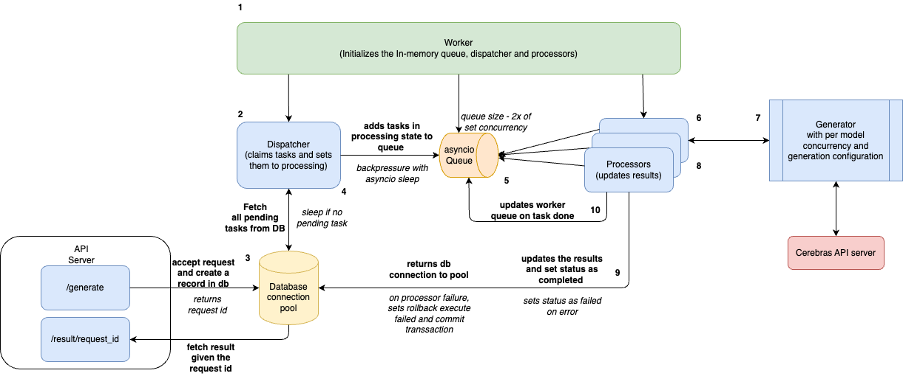

# Cerebras Synthetic Data Generator

This project provides a high-performance, asynchronous proxy system for generating synthetic data using the Cerebras Cloud Inference API. It features a FastAPI-based queue system that acts as a proxy to the actual Cerebras endpoint, with dedicated workers handling the processing at maximum capacity.

## Architecture Overview



The system consists of three main components:

### 1. **API Server** (`api_server.py`)
- FastAPI-based web server that accepts generation requests
- Queues requests in a SQLite database
- Returns request IDs immediately for asynchronous processing
- Provides endpoints to check request status and retrieve results

### 2. **Worker System** (`worker.py`)
- **Dispatcher**: Single task that claims pending jobs from the database
- **Processors**: Multiple concurrent tasks that handle the actual API calls to Cerebras
- Uses an in-memory queue to eliminate database write contention
- Supports high concurrency (200+ workers) without performance degradation

### 3. **Client** (`api_client.py`)
- Batch processing client that submits datasets to the API server
- Polls for results and handles retries/timeouts
- Supports concurrent request submission and result polling

## Key Features

-   **High-Performance Proxy**: Acts as a queue-based proxy to Cerebras API with configurable concurrency per model
-   **Asynchronous Processing**: Uses `asyncio` and producer-consumer pattern for maximum throughput
-   **Dynamic Load Monitoring**: Tracks Time to First Token (TTFT) to infer server load and adjusts behavior accordingly
-   **Database Queue**: SQLite-based persistent queue with WAL mode for high concurrency
-   **Robust Error Handling**: Comprehensive retry logic with exponential backoff
-   **Configuration Driven**: All parameters managed via YAML configuration
-   **Flexible Data Sources**: Supports local files and Hugging Face datasets
-   **Progress Tracking**: Real-time progress monitoring and statistics

## Installation

1.  **Clone the repository:**
    ```sh
    git clone https://github.com/sarathc-cerebras/cerebras-data-generator.git
    cd cerebras-data-generator
    ```

2.  **Create and activate a virtual environment (recommended):**
    ```sh
    python3 -m venv .venv
    source .venv/bin/activate
    ```

3.  **Install the required packages:**
    ```sh
    pip install -r requirements.txt
    ```

## Configuration

All system behavior is controlled by `config/inference-config.yaml`. Below is the complete configuration structure:

```yaml
# Models to run inference against
models_to_run:
  - name: "qwen-3-32b"
    concurrency:
      max_concurrent_requests: 10
      min_concurrent_requests: 1
      recover_threshold: 5
    generation:
      temperature: 0.7
      max_completion_tokens: 2000

# Worker system configuration
worker:
  concurrency: 200  # Total number of concurrent workers

# Global concurrency and retry settings
concurrency:
  max_concurrent_requests: 10
  min_concurrent_requests: 1
  recover_threshold: 5
  initial_retry_delay: 1.0
  max_retry_delay: 60.0
  max_retries: 5

# Load monitoring thresholds
load_monitoring:
  ttft_threshold: 5.0
  request_timeout: 120.0

# API generation parameters
generation:
  stream: true
  max_completion_tokens: 20000
  temperature: 0.7
  top_p: 0.8
  seed: 1

# Database configuration
database:
  path: "data/queue.db"

# API server settings
api_server:
  host: "0.0.0.0"
  port: 8000

# Dataset configuration (for batch mode)
dataset:
  repo_type: hf
  output: "data/output/generated.jsonl"
  
  hf:
    repo: "BAAI/Infinity-Instruct"
    subset: "7M"
    split: "train"
    streaming: true
  
  n_samples: 1000
```

## Authentication

The API server supports token-based authentication for both API endpoints and the admin panel.

### Setup Authentication

1. **Generate API tokens:**
   ```bash
   python scripts/generate_tokens.py
   ```

2. **Configure server with tokens:**
   ```bash
   export API_AUTH_TOKENS="token1,token2,token3"
   export CEREBRAS_API_KEY='your-cerebras-api-key'
   python src/api_server.py
   ```

3. **Configure client:**
   ```bash
   export CEREBRAS_PROXY_API_TOKEN="token1"
   ```

**Note:** If `API_AUTH_TOKENS` is not set, the server runs in development mode without authentication.

## Admin Configuration Panel

Access the web-based admin panel to manage configuration without restarting the server:

### Features

- 📊 **Real-time Statistics**: Monitor queue status, worker count, and active tasks
- ⚙️ **Worker Management**: Adjust worker concurrency dynamically
- 🤖 **Model Configuration**: Add, remove, and configure models on-the-fly
- 🌐 **Global Settings**: Modify retry logic, timeouts, and load monitoring
- 💾 **Persistent Changes**: Configuration changes are saved to YAML file
- 🔄 **Live Reload**: Reload configuration from file without restart

### Access Admin Panel

1. **Start the API server:**
   ```bash
   cd src
   python api_server.py
   ```

2. **Open your browser:**
   ```
   http://localhost:8000/admin
   ```

3. **Login with your API token**

### Configuration Changes

All changes made through the admin panel:
- ✅ Take effect immediately
- ✅ Are saved to `config/inference-config.yaml`
- ✅ Persist across server restarts
- ✅ Don't require worker restart

### Supported Configuration

- **Worker Concurrency**: Adjust total concurrent workers
- **Model Settings**: Configure per-model concurrency and generation parameters
- **Retry Logic**: Tune retry delays and maximum attempts
- **Load Monitoring**: Adjust TTFT thresholds and request timeouts
- **Generation Parameters**: Temperature, top_p, max_tokens, streaming

## Usage

### API Server Mode (Recommended)

1.  **Set your Cerebras API Key:**
    ```sh
    export CEREBRAS_API_KEY='your-api-key-here'
    ```

2.  **Start the API Server:**
    ```sh
    cd src
    python api_server.py
    ```

3.  **Submit requests using the client:**
    ```sh
    python api_client.py \
        --dataset-repo "BAAI/Infinity-Instruct" \
        --dataset-subset "7M" \
        --n-samples 1000 \
        --max-concurrency 100 \
        --output-file "results.jsonl"
    ```

### Batch Mode (Direct Processing)

For direct processing without the API server:

```sh
cd src
python generator.py
```

## API Endpoints

### POST `/generate`
Submit a generation request:

```json
{
  "conversations": [
    {"from": "human", "value": "What is machine learning?"}
  ],
  "model": "qwen-3-32b",
  "metadata": {"id": "example-1"}
}
```

Response:
```json
{
  "request_id": "task:12345-67890",
  "message": "Request accepted for processing."
}
```

### GET `/result/{request_id}`
Check request status and get results:

- **202**: Still processing
- **200**: Completed (returns generated content)
- **500**: Failed (returns error details)
- **404**: Request not found

### GET `/health`
Health check endpoint

### GET `/stats`
Get queue statistics:

```json
{
  "queue_stats": {
    "pending": 150,
    "processing": 45,
    "completed": 0,
    "failed": 2
  },
  "total_tasks": 197
}
```

## Performance Tuning

### Worker Concurrency
Adjust based on your system capabilities:

```yaml
worker:
  concurrency: 500  # Increase for more throughput
```

### Model-Specific Limits
Configure per-model concurrency:

```yaml
models_to_run:
  - name: "qwen-3-32b"
    concurrency:
      max_concurrent_requests: 20  # Higher for faster models
```

### Client Concurrency
Control client-side request submission:

```sh
python api_client.py --max-concurrency 200
```

## Monitoring and Debugging

### Real-time Statistics
Monitor queue status:
```sh
curl http://localhost:8000/stats
```

### Verbose Logging
Enable detailed logging:
```sh
python api_client.py --verbose [other-options]
```

### Log Files
- API Server: Check console output for worker status
- Client: Monitor polling progress and error rates

## Architecture Benefits

1. **High Throughput**: Producer-consumer pattern eliminates database contention
2. **Fault Tolerance**: Individual task failures don't affect the system
3. **Scalability**: Easy to scale workers based on load
4. **Resource Efficiency**: Connection pooling and proper resource management
5. **Monitoring**: Built-in health checks and statistics
6. **Flexibility**: Support for multiple models with different configurations

## Troubleshooting

### Database Locked Errors
If you see "database is locked" errors, the dispatcher-processor architecture should eliminate these. Ensure you're using the latest worker implementation.

### High Memory Usage
Reduce the worker queue size:
```yaml
worker:
  concurrency: 100  # Reduce if memory is limited
```

### Slow Processing
1. Check `/stats` endpoint for queue buildup
2. Increase worker concurrency if CPU/memory allows
3. Monitor TTFT for API performance issues
4. Check Cerebras API rate limits

### Client Timeouts
Increase polling timeout:
```sh
python api_client.py --poll-interval 2.0
```

## Output

-   **API Mode**: Results saved to specified output file in JSONL format
-   **Console Logs**: Progress tracking, TTFT monitoring, and error reporting
-   **Statistics**: Real-time queue status via `/stats` endpoint

Each output line contains:
```json
{
  "id": "example-1",
  "conversations": [
    {"from": "human", "value": "What is machine learning?"},
    {"from": "gpt", "value": "Machine learning is..."}
  ],
  "model": "qwen-3-32b",
  "source": "BAAI/Infinity-Instruct"
}
```